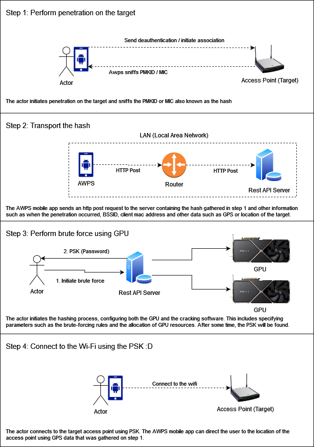
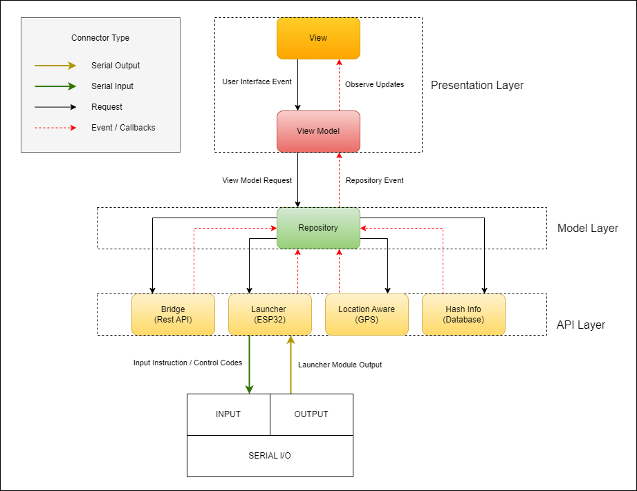

# AWPS (Automatic Wi-Fi Penetration System) Command Launch Module

AWPS is a penetration software for effortlessly penetrating WiFi-enabled devices secured with WPA2. AWPS provides a way for user to attack nearby access point using an android device automatically or manually. It harnesses the robust capabilities of the ESP32 microcontroller to execute a vital operation in Wi-Fi network penetration. By capturing key data elements like the PMKID and MIC, AWPS allows users to conduct offline brute force attacks using hashcat to derive the PSK or the password of the target Wi-Fi device.

The Command Launch Module which is an android application act as the brain of the operations, directing the Launcher Module by generating instruction codes, selecting targets, securely storing hashes in a local database, receing GPS coordinates and the transmission of data to a server. The AWPS Launcher Module is an ESP32 which receives command from the Command Launch Module via serial communication, it executes the attack based on the instruction code provided by the Command Launch Module.

For a deeper dive into the Launcher Module's capabilities and further insights, explore the repository [here](https://github.com/johndeweyzxc/AWPS-Launcher-Module).

## Features

- **Local Database** Temporary local database for PMKID or MIC and EAPOL data intercepted by the Launcher Module.
- **Location Aware** Uses GPS functionality to precisely record the location of data interception.
- **Hash Transmission** Enables the seamless transfer of captured PMKID, MIC, and EAPOL data to
  a local REST API server. Visit this [repository](https://github.com/johndeweyzxc/AWPS-Bridge) for more information
- **Automatic Attack Mode** Automates the penetration of nearby access points while preventing re-attacks on previously targeted access points. All intercepted and relevant data is stored in a local database for comprehensive record-keeping.
- **Manual Attack Mode** Manual method for penetrating nearby access points. All intercepted and pertinent data is systematically stored in a local database, fostering comprehensive record-keeping.

## How to Hack or Penetrate the Wi-Fi using AWPS and GPU

    

Note: The android device presented in the story is the Command Launch Module, the Launcher Module is attached to the Command Launch Module. The actor in step 3 does not send an HTTP request to the Rest API server. The actor directly configures the GPU via a software by typing in the commands. Also the Rest API is only available as a local Rest API server in the LAN. Its primary role is to receive hash from the AWPS android app and store it in a database.

## Software Architecture

    

## Software Components

This module consists of 4 main components, the view, view model, repository and the apis. Here is the brief description of each component:

- **View** Application's user interface encompasses activities, fragments, and other UI-related code. This is where the user interacts with the system.
- **View Model** Connects the view and the repository, it validates user input and also formats data to be consume by the view.
- **Repository** This is the business part of the application where it is responsible for processing inputs and outputs to and from the APIs.
- **APIs** Primary data source for the repository, encompassing functionalities such as controlling the launcher module, sending HTTP requests to a server, and persisting data in a local database database.

## Hardware Components

In this project, three hardware components are employed: an Android device, USB OTG (On The Go), and the ESP32. While the project has been rigorously tested on the ESP32-WROOM-32D variant, it is expected to be compatible with any microcontroller based on the ESP32-WROOM-32 platform.

    

- **[1] Android Phone** Any android-powered device that can be use to install a Command Launch Module which is the interface that the user will use to control the operations.
- **[2] USB OTG (On The Go)** Enables communication between the Command Launch Module and the Launcher Module. It also delivers power from the Command Launch Module to the Launcher Module.
- **[3] Micro USB Male to USB Male** Establishes connection between the ESP32 device and a USB male port.
- **[4] ESP32-WROOM-32D** This is where the Launcher Module Software is installed and it is use to execute attacks by receiving commands from the Command Launch Module.

## DISCLAIMER

The project AWPS is intended for educational purposes, with the primary goal of raising awareness and understanding of cybersecurity in a legal and ethical context. It is essential to clarify that this tool is NOT INTENDED to encourage or promote any form of unauthorized or unethical hacking activities. Ethical hacking, conducted with proper authorization and consent, plays a crucial role in enhancing the security of digital systems. This project seeks to promote responsible use of technology and responsible disclosure of vulnerabilities to help protect and secure digital environments.

USAGE OF ALL TOOLS on this project for attacking targets without prior mutual consent is ILLEGAL. It is the end user’s responsibility to obey all applicable local, state, and federal laws. I assume no liability and are not responsible for any misuse or damage caused by this project or software.
