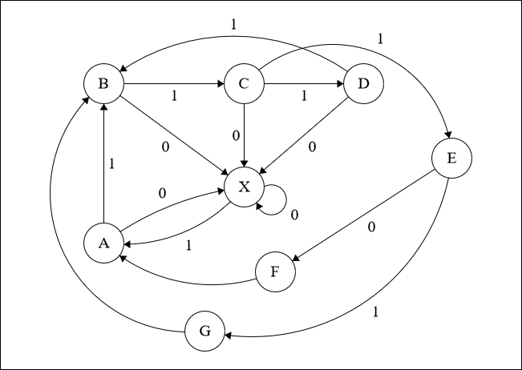

## Automatic Attack Finite State Diagram

    

The finite state diagram illustrates the automated process of Wi-Fi penetration through a sequence of states in an automatic attack.

- **State: X(Stopped)**
  - **Description:** The system enters stopped state and does not perform any penetration operation unless the user presses the start button
- **State: A (Started)**
  - **Description:** The system enters started state because the user presses the start button, the Launcher Module is ready to receive commands
  - **Transition**
    - **Trigger:** The system receives an instruction
    - **Outcome:** Transition to state B occurs unless the user presses the stop button
- **State: B (Instruction Issued)**
  - **Description:** The system enters state B when it received an instruction code
  - **Transition:**
    - **Trigger:** The system has finished scanning nearby access points
    - **Outcome:** Transition to State C occurs unless the user presses the stop button
  - **Note:** An instruction code can be a scan code or an attack code. If the system transitions to this state because an attack instruction is issued, it re-scans nearby access point and checks if it found the target access point (State C), it needs to do this to determine the channel and SSID of the target. After each attack, a scan instruction is issued so it goes back to this state to scan nearby access point but it does not look for the target since this is just a scan instruction
- **State: C (Finish Scan)**
  - **Description:** The system enters finished scan state, it is now ready to determine if the target access point is found or not
  - **Transition:**
    - **Trigger:** The system has finished determining if the target access point is found
    - **Outcome:** Transition to State D or State E occurs unless the user presses the stop button
- **State: D (Target Not Found)**
  - **Description:** The system transitions from C to D because it did not found the target access point
  - **Transition:**
    - **Trigger:** The system did not found the target access point
    - **Outcome:** Transition to State B occurs unless the user presses the stop button, it transistions to State B to issue a scan instruction where it scans nearby access points for potential targets
- **State: E (Main Task Created or Attack Target)**
  - **Description:** The system transitions from C to E because it found the access point and thus it launches the attack
  - **Transition:** The system has finished or stopped the main task
    - **Trigger:** Transition is triggered under three conditions: when the allocated time is exhausted, when the user presses the stop button, or when the attack is successful
    - **Outcome:** Transition to State G occurs unless the user stops the attack or the allocated time has exhausted
- **State: F (Failed Attack)**
  - **Description:** The system enters failed state when the attack is terminated either by user pressing the stop button or when the allocated time has exhausted.
  - **Transition:** The Launcher Module is programmed to restart if an attack fails and thus
    will always transition to State A
- **State: G (Successful Attack)**
  - **Description:** The system enters success state because it was able to penetrate the target and was able to intercept important data
  - **Transition:** The system proceeds to State B to issue a scan instruction where it scans nearby access points for potential targets
